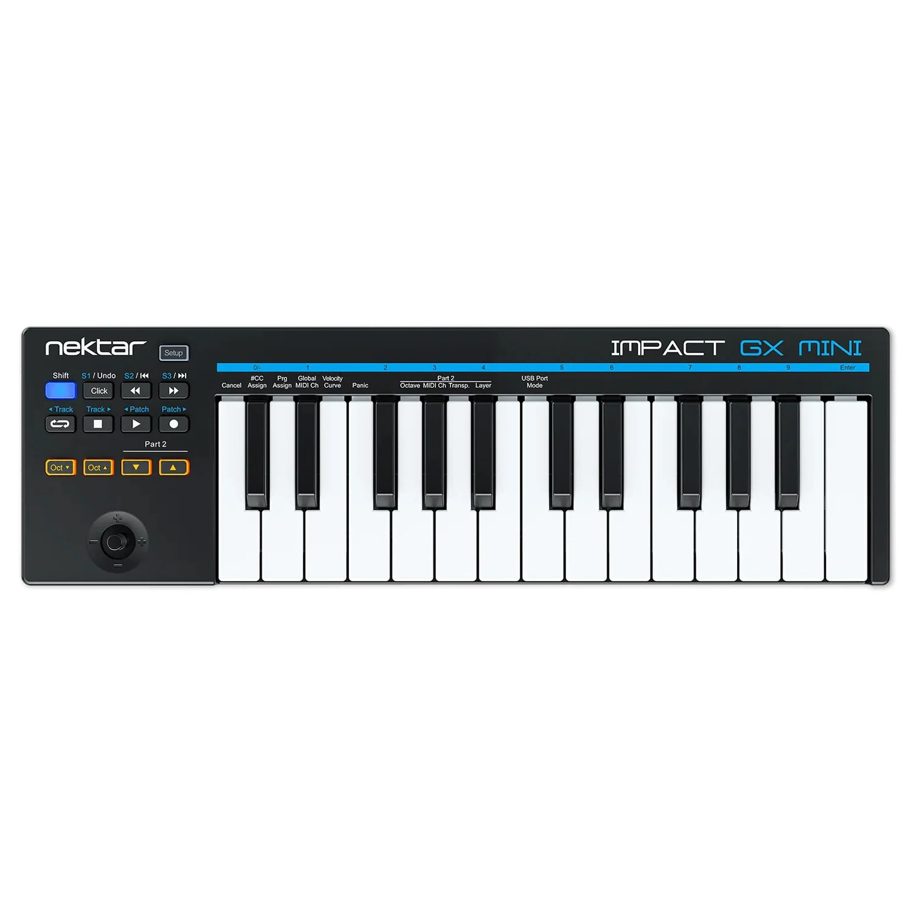

It is Oct 24th and this is my second post!
I was thinking about writing more stuff on my hobbies, and in this post I'm going to mainly write about composing music, and my music tinkering around with logic pro on mymac

## Composing Music
First off, I'm an absolute beginner when it comes to composing music. While I was able to just create some melodies of my own, two to be exact, what I am still struggling to do is, actually making a fully fledged song. I believe making a song, not the main melody but instead the accompaniment and stuff is supposed to be called the arranging a song? Probably.

## Arranging a Song, trying to learn it
So I need to learn how to arrange songs. But what is it? It's about basically about creating harmony for your melodies. Creating a melody is probably like, 5% of the song. Making a fully fledged song involves having to create harmony, or the accompaniment, and think about instrumentation, and such. But I think the toughest part about arranging a song is the fact that, you basically need to learn **Music Theory**!

## Music Theory, as a Self Taught Composer
So I am a self taught composer, and I have been trying to compose music on my own since I was in high school. Now I am 27, and for about 10 years I have been learning music theory. And after 10 years I think I can confidently say that I have made close to zero progress :P
Well maybe a bit more than that. Though it is kind of tough for me to pinpoint how much my musical level has improved over the years. I might be able recognize some pretty well known chord progressions when I'm listening to a tune, like the II-V-I or the IV-V-III-VI (jpop progression) and such, but that's about it. I think that's pretty cool still, but that's not really the kind of level you would expect from learning music theory for a whole decade. Though the real problem is that out of that whole decade I've only dedicated probably a month of real learning time. This is probably the downside of being self-taught is that, without real motivation you are likely to make zero progress without any guidance.

### My motivation to learn Music
Learning to make cool music has been one of my few goals in life. I remember when I was young, one of my earliest memories that I am very fond of is me on the floor over some blankets, doing it asian style without a bed and just a blanket over the floor, and seeing princess mononoke on the phone with my relatives. I was 6 or something so I don't remember a single thing about the movie's plot, but the music, oh man did it leave such an impression. Oh and I do remember one of the wolfs just biting a woman's arm off, and thinking the movie was way too violent and scary. At a later point in time I decided to checkout howl's moving castle on my own or something, and man was I blown away by that soundtrack as well. Listening to the main theme of howl's moving castle, even as a kid felt surreal. There was something about hearing that theme for the first time, that made me feel emotions, that are hard to describe. But it was so pleasing and ethereal, and even as a six year old, I have dreamt of being able to create music just like that. A waltz tune is something that I do want to try composing eventually, though all I really understand about waltz is that the time signature is three-four... XP

## Type of Genre I want to compose
So what other genre other than waltz? I guess one would be funk... because I'm a sucker for music that makes you want to grooove. But other than that naming a genre can be a little meaningless when describing the type of music I want to compose. Let me show you some examples using some of my favorite music. So the songs below are list of songs that I think are hard to define using a typical genre name
1. [Pokemon Gold & Silver - National Park theme](https://www.youtube.com/watch?v=2XjouKSkSeM&ab_channel=pokemonmusicmaster)
2. [Pokemon Diamond & Pearl - Lake theme](https://www.youtube.com/watch?v=gL_94zAbBaY&ab_channel=Nullfuchs)
3. [Pokemon Black 2 & White 2 - Aspertia City](https://www.youtube.com/watch?v=zmJUMf60INI&t=216s&ab_channel=OfficialVGM%3AArchive)
4. [Ori and the Will of the Wisps - Dashing and Bashing](https://www.youtube.com/watch?v=CMZ6PV_6QG0&ab_channel=GarethCoker-Topic)
5. Hollow Knight OST, the entire thing

If you actually try and give these songs a listen, it probably won't be as easy defining a genre for them. The first song, the national park theme, could be categorized as a chiptune song, since it was for the gameboy color that could only play 8 bit songs using its limited 4 sound wave channels and such. But the other two songs are from the later geneartions of pokemon, that were released on much more advanced and capable hardware like the nintendo ds that had I believe 16 or 32 audio channels to use. So at that point onwards, it's not really fair to call songs 2 and 3 a chiptune or 8 bit song. Basically the hardware limitations are gone, and from there what makes it feel like a video game song is kind of... gone as well thanks to the absence of hardware limitations. So in terms of genre, pokemon songs ever since the nintendo ds (and even the gameboy advance) they're genre is probably just videogame, or adventure, or just pokemon soundtrack. From this point on I'll just call the genre I want to compose, videogame genre. (Videogame is just the name of the medium, so it feels kind of wrong to say but, I just don't have any better category I want to use)

## Composing Video Game Music
So I'm trying to compose some video game music (not to actually use it for a video game though), the likes of which are Zelda, Mario, Pokemon, Kirby and etc. Most of them are Nintendo games as one might have picked up on. I do love me some nintendo game music, and boy are there are a lot of bangers. Speaking of nintendo music, let's use one song in particular to really speak more about the music theory aspect of songs.
Let's again use this song that I really like, the lake theme from Pokemon Diamond and Pearl.
[Pokemon Diamond & Pearl - Lake theme](https://www.youtube.com/watch?v=gL_94zAbBaY&ab_channel=Nullfuchs)
Other than it being a complete banger 🔥🔥🔥, what other things can I learn from it in terms of music theory?
In order to learn music that I want to enjoy, music theory is pretty much inevitable, which is also the bottleneck of making good progress for me, so today I continue on my long journey of learning music.

## The Lake theme, a breakdown
If you want a real in-depth analysis of the lake theme, [checkout 8 bit music theory's video on it](https://www.youtube.com/watch?v=TuJ9Cn_HBeQ&ab_channel=8-bitMusicTheory)!
8bit Music Theory is a youtube channel, that I've definitely subscribed and have watched for many years. His stuff is absolutely fantastic, especially for you people who likes to learn more music theory, but using video game music! For me it's basically the best of both worlds.
In any case, 8 bit music theory does a breakdown of the chords of the song, and explain something call metric modulation, which I won't go super in detail about, but it is basically about rhythmically changing pace. In this post I want to focus more on, some of the chord changes that I think are pretty interesting.
Actually check [this video from Charles Cornell that does a breakdown of the Lake theme!](https://youtu.be/c7uZVkxp_q4?si=A-VRhDeWBXz0DEe8&t=406). 
By the way Charles Cornell is also another musician Youtuber who teaches music theory and he often covers my favorite music a lot too so, go subscribe!
The part I want to focus on is 6 minutes into the video where he explains the move from a Dmaj7, to F/G, to a Bbmaj7. Basically from the Dmaj7, which is supposed to be temporary tonal center, we want to get to the Bbmaj7 because that's where the song loops. There are a basically a lot of different ways you can go about moving from one chord to another, but a F/G is basically... sort of unconventional and does not necessarily make a lot of sense. 
To provide a bit more context, the Bbmaj7 is not supposed to be a tonal center, but it is a 4 chord that later sort of resolves to the Fmaj7 chord. We could choose to just use a secondary dominant of the Bbmaj7, namely a F7 or whatever, but for some reason we use F/G, or like a G7sus. Basically even for a music theory expert, he doesn't explain this chord change as, something that necessarily makes a lot of sense music theory wise, and just explains that this move was done because... it sounds good.

## It just sounds good, a lesson in music theory
This was kind of eye opening for me, the idea that something can just be done, because it sounds good. For me, I have wasted 10 whole years trying to be like a music theory expert, that can identify a chord progression by just using my ear, and can think of a good chord progression on the fly. I didn't feel ready to compose music before learnig music theory enough. But the reality is that, if you want to compose music, probably basic music theory is more than enough for you to just start learning how to compose and produce music. But wait, I also just told you in this post that, learning how to arrange requires music theory, and that to become a good composer I need to learn music theory...right? Well yeah that's probably also true, and there is a LOT to learn when it comes to music theory and chord progressions! But what I'm saying is, stop deterring yourself from just creating music, and don't be embarassed about being a complete pile of garbage when you first create your own music.
So in a nutshell, if you want to create music, your gonna suck anyhow, unless your one of those geniuses. Do it and learn arranging and stuff while you're actually doing it. Otherwise you might end up like me who made a laughable progress on both learning music theory and actually composing music. It's probably best for you to try and do both and learn it on the job.

## Am I actually composing music right now?
Yes, right now I am. Though there is the chance that I'll just quit soon... because though it is fun to try and learn something, it sure as heck isn't fun when you succ hard.
When your just fiddling with all the buttons on logic pro wondering what they do, and then you see geniuses like [Reo, a Japanese Composer on youtube](https://www.youtube.com/watch?v=UvSVJkRsrC4&ab_channel=Reo) that just creates jam 🍓 after jam 🍓 after jam 🍓, it is hard to not to get discouraged. But again, what can you do other than to just suck it up and keep learning. 
Speaking of which, here is the progress I made on using logic pro

## Logic Pro, apparently a highly rated DAW
My first impressions of using logic pro is...just mid. I didn't enjoy it THAT much, but that's probably more because I have never used a DAW in my life, and I have only every tried learning songs on the piano. 
By the way if you're trying to learn an instrument to become a better compose, it will be your best bet to learn the piano, as it gives you a good way to understand harmony, by actually seeing all the notes that make up a chord using your two hands, and having to learn about top voicings and such!
Speaking of using a DAW for the first time, I have never had to use a MIDI instrument as well, so I am thinking about buying one small MIDI piano, probably this one called the 
.

I will likely create another post that has to do with music theory more later on, and it will be about, comping and how to make chord progressions more fun to hear!